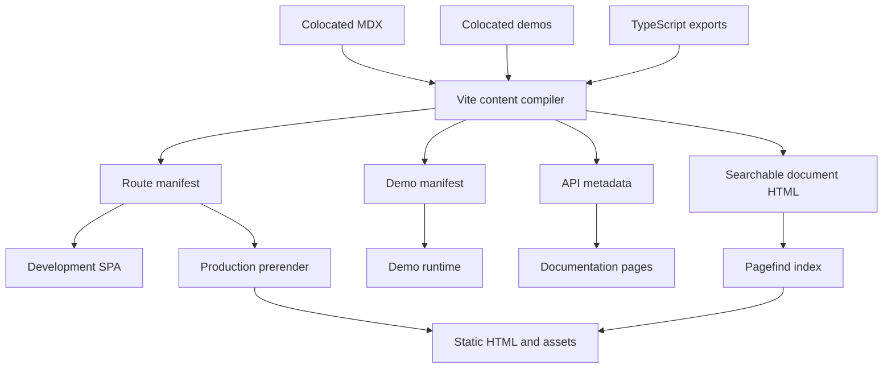
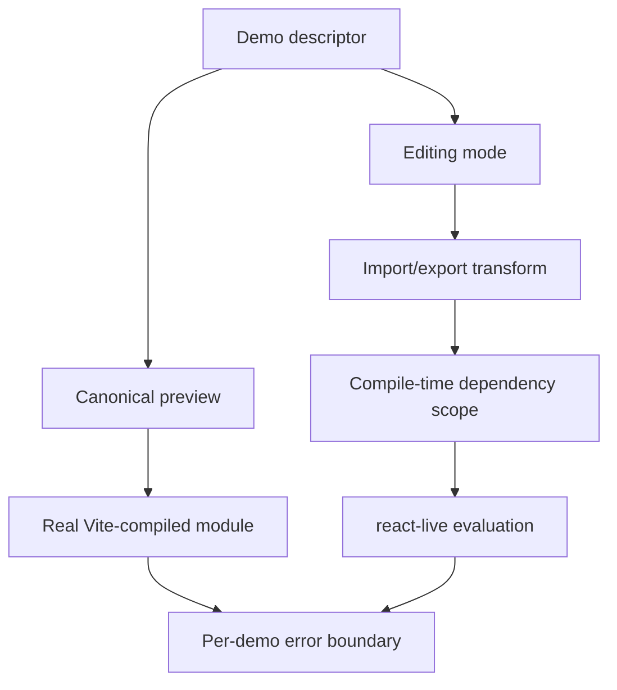
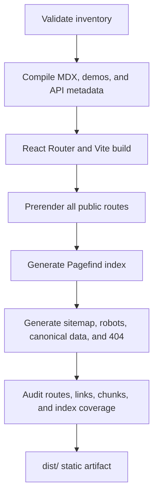

# Lobe UI Documentation Platform Replacement Design

**Date:** 2026-07-11  
**Status:** Approved for implementation planning  
**Scope:** Replace the dumi documentation framework and redesign the documentation product

## 1. Summary

Lobe UI will replace dumi and `dumi-theme-lobehub` with a documentation application built on Vite, React Router Framework Mode, MDX, and a project-owned content compiler.

The new application will run as a client-rendered SPA during development and produce a fully static, pre-rendered site for production. Component documentation and demos will remain colocated with component source code. Existing public component routes and dumi standalone demo URLs will remain valid.

The product design follows a documentation-first, three-column layout. Its structural clarity is informed by Vercel and Geist, while its visual identity uses LobeHub branding: the LobeHub mark, restrained spectral accents, soft ambient color, rounded surfaces, and high-contrast functional areas.

## 2. Goals

1. Remove dumi, `dumi-theme-lobehub`, `.dumirc.ts`, `.dumi/`, and all dumi runtime coupling.
2. Preserve colocated component documentation and demos.
3. Replace the existing Markdown dialect with explicit MDX.
4. Provide a fast Vite SPA development experience with HMR.
5. Pre-render every public documentation and standalone demo route for static deployment.
6. Preserve existing `/components/...` and `/~demos/...` URLs.
7. Provide real Vite-rendered demos and optional `react-live` editing.
8. Generate accurate API references from TypeScript while retaining human-authored guidance.
9. Provide fully static local search without an external hosted service.
10. Support Light, System, and Dark themes, including independently themed demo previews.
11. Establish a distinctly LobeHub documentation product rather than reproducing another generic documentation framework.

## 3. Non-goals

- Building a general-purpose documentation framework for external repositories.
- Introducing a server runtime, database, authentication layer, or hosted search service.
- Moving documentation or demos away from their component directories.
- Providing a full browser-based Vite project environment, package installation, or terminal.
- Preserving dumi syntax as a permanent compatibility layer.
- Redesigning component APIs as part of the documentation migration.
- Adding documentation localization beyond the current English scope.

## 4. Confirmed Decisions

| Area             | Decision                                                              |
| ---------------- | --------------------------------------------------------------------- |
| Content location | Keep `src/<Component>/index.*` and `demos/` colocated with components |
| Content format   | Rename component documentation from `.md` to explicit `.mdx`          |
| Development      | Vite-powered SPA with HMR                                             |
| Production       | Fully static pre-rendered output                                      |
| Routing          | React Router Framework Mode with `ssr: false` and `prerender`         |
| Demo editing     | `react-live` component sandbox                                        |
| Demo coverage    | Editable by default, with an explicit read-only opt-out               |
| API reference    | Human-authored guidance plus TypeScript-generated property data       |
| Search           | Local Pagefind index with a custom LobeHub command menu               |
| Themes           | Light, System, and Dark; demo theme can differ from site theme        |
| Page URLs        | Preserve all existing public component paths                          |
| Demo URLs        | Preserve exact dumi `/~demos/:demoId?routeId=...` URLs                |
| Visual baseline  | Vercel-like structural discipline with LobeHub brand expression       |

## 5. Current Migration Surface

The repository currently uses dumi for route discovery, navigation generation, Markdown rendering, demo embedding, standalone demo routes, source display, aliases, development-time API parsing, and site theming.

An initial repository scan found:

- 369 dumi `<code src="...">` references;
- 375 tracked files under demo directory trees, including demo entries, helpers, data, and tests;
- component documentation spread across the root component namespace and the `awesome`, `brand`, `chat`, `color`, `icons`, `mdx`, `mobile`, `storybook`, and `base-ui` namespaces;
- a non-documentation build script importing the package namespace list from `.dumirc.ts`.

These numbers are reconnaissance, not migration authority. The first implementation step will generate a committed or CI-persisted baseline report of all public routes, demo IDs, source files, and MDX targets. Completion will be measured against that inventory.

## 6. Architecture

### 6.1 System flow



### 6.2 Directory ownership

```text
site/
├── app/                  React Router layouts, pages, providers, and search UI
├── compiler/             Build-only MDX, demo, route, and API compilation
├── components/           Documentation, Demo, API, and navigation renderers
├── routes.ts             Public, standalone demo, and error routes
└── styles/               Documentation visual system

src/<Component>/
├── index.mdx             Colocated component documentation
├── demos/                Colocated demo entries and supporting modules
└── *.tsx                 Component implementation

docs/
├── index.mdx             Documentation home content
├── changelog.mdx         Changelog content
└── superpowers/specs/    Design and implementation specifications
```

The `site/` directory owns the documentation application. It must not become part of the published `@lobehub/ui` package. Component source remains the source of truth for both the library build and documentation examples.

### 6.3 Virtual modules

The content compiler exposes build artifacts through Vite virtual modules:

- `virtual:lobe-docs/routes`
- `virtual:lobe-docs/demos`
- `virtual:lobe-docs/api`
- `virtual:lobe-docs/navigation`

Virtual modules are generated in memory or in ignored build caches. They are not committed source files.

### 6.4 Code splitting

- Each documentation page is a separate route chunk.
- Each demo entry is loaded through a separate dynamic import.
- `react-live` loads only when the code editor is opened.
- Pagefind loads only when search is focused or invoked.
- Standalone demo routes do not load the documentation navigation shell.
- The initial documentation bundle must not include unrelated demos.

## 7. Routing and Rendering Model

### 7.1 React Router configuration

React Router Framework Mode will use:

- `ssr: false` to avoid a production server and retain SPA development;
- `prerender` with the complete route list produced by the content compiler;
- a generated SPA fallback for valid paths not represented by a static HTML file;
- explicit 404 handling for unknown documentation and demo routes.

React Router documents this exact static deployment model: <https://reactrouter.com/how-to/pre-rendering>.

### 7.2 Public documentation routes

Existing component paths remain canonical. Examples include:

- `/components/button`
- `/components/base-ui/select`
- `/components/chat/chat-input-area`
- `/components/mobile/chat-input-area`

Route derivation follows existing public behavior. A route may be declared explicitly in frontmatter when file-system derivation would change an existing URL.

### 7.3 Standalone demo routes

The application preserves:

```text
/~demos/:demoId?routeId=<encoded-document-route>
```

For example:

```text
/~demos/src-button-demo-demos?routeId=components%2FButton%2Findex
```

Standalone pages render only the demo environment. They do not render the documentation header, navigation, table of contents, comments, or footer.

The `routeId` query parameter remains accepted for URL compatibility and contextual metadata. Demo resolution is based on the frozen demo ID manifest rather than on the query parameter.

### 7.4 Legacy demo mapping

Migration generates a frozen compatibility map:

```json
{
  "src-button-demo-demos": {
    "source": "src/Button/demos/index.tsx",
    "routeId": "components/Button/index"
  }
}
```

The mapping is committed because source files may be renamed later. Reimplementing dumi's internal ID algorithm would not provide durable compatibility.

New demos receive deterministic IDs derived from their source path. Existing IDs remain aliases indefinitely unless a separate breaking-change decision removes them.

### 7.5 Static HTML behavior

Documentation text, headings, API content, metadata, and navigation must be present in pre-rendered HTML. Demo frames render deterministic placeholders during pre-rendering. Interactive demo modules load after client hydration so browser-only code cannot break SSG.

Standalone demo pages provide static metadata and a loading frame, then load the demo on the client.

## 8. MDX Content Protocol

### 8.1 File format

All component documentation is explicitly renamed from `index.md` to `index.mdx`. Files containing JSX or module imports must not retain a `.md` extension.

### 8.2 Example document

```mdx
---
title: Button
description: Triggers an action or event.
category: General
order: 10
status: stable
---

import Basic from './demos/index.tsx?demo';
import Variants from './demos/Variant.tsx?demo';

## Usage

<Demo of={Basic} title="Default" layout="center" />

## Variants

<Demo of={Variants} />

## API

<Api name="Button" />
```

### 8.3 Frontmatter

Supported core fields are:

| Field         | Requirement             | Purpose                                         |
| ------------- | ----------------------- | ----------------------------------------------- |
| `title`       | Required                | Page and navigation title                       |
| `description` | Required                | Page introduction, metadata, and search context |
| `category`    | Required for components | Navigation group                                |
| `order`       | Optional                | Stable order within the category                |
| `status`      | Optional                | Stable, beta, deprecated, or experimental       |
| `since`       | Optional                | First package version containing the component  |
| `route`       | Exceptional             | Explicit legacy route preservation              |

The migration codemod converts existing `nav` and `group` values into the new schema. It must preserve existing ordering where meaningful.

### 8.4 MDX component surface

The initial global MDX component set is intentionally small:

- `Demo`
- `Api`
- `Callout`
- `Steps`
- `Tabs`
- `Badge`
- standard Markdown elements rendered through the documentation typography layer

Arbitrary local imports remain allowed because MDX is an executable module format. Global components cover repeated documentation primitives and keep routine documents concise.

### 8.5 Migration from dumi syntax

The codemod performs a one-time conversion:

| Existing syntax           | MDX result                              |
| ------------------------- | --------------------------------------- |
| `<code src="..." />`      | `?demo` import plus `<Demo of={...} />` |
| `center`                  | `layout="center"`                       |
| `nopadding` / `noPadding` | `layout="bare"`                         |
| `iframe`                  | `isolated`                              |
| `inline`                  | Normal embedded demo                    |

No runtime parser will retain support for dumi `<code src>` tags after migration.

## 9. Demo Module Protocol

### 9.1 `?demo` transformation

An import ending in `?demo` resolves to a normalized descriptor:

```ts
interface DemoModule {
  id: string;
  load: () => Promise<React.ComponentType>;
  loadScope: () => Promise<Record<string, unknown>>;
  source: string;
  editable: boolean;
}
```

The descriptor separates metadata and source from runtime evaluation. Importing the descriptor during SSG must not execute the demo module or its editable dependency scope. Both are loaded only after hydration.

### 9.2 Dual execution paths



The canonical preview always renders the actual Vite module. `react-live` is an editing enhancement, not the source of truth for demo behavior.

### 9.3 Editing behavior

- The preview remains visible while the editor is open.
- The editor is collapsed by default.
- The expanded state is stored as a local user preference.
- Opening the editor lazy-loads `react-live`.
- Static import analysis creates the evaluation scope.
- Relative data and helper modules are injected as read-only dependencies.
- A failed edit preserves the last successful preview.
- Reset restores repository source.
- Errors are shown inline with actionable locations where available.

### 9.4 Read-only escape hatch

Demos are editable by default. Complex demos may opt out:

```mdx
<Demo of={ComplexDemo} editable={false} />
```

Read-only demos still provide:

- canonical preview;
- source display;
- copy source;
- standalone preview;
- full-screen and viewport controls where applicable.

Likely read-only candidates include examples with complex dynamic imports, multi-file streaming fixtures, browser workers, large embedded HTML documents, or behavior that cannot be represented safely by a `react-live` scope.

### 9.5 Demo frame controls

The demo frame supports:

- expand or collapse code;
- Reset;
- Copy;
- standalone preview;
- full screen;
- responsive viewport presets;
- independent Light or Dark theme selection.

All controls are keyboard accessible and provide visible focus and accessible names.

## 10. TypeScript API Extraction

### 10.1 Source of truth

The TypeScript compiler graph is the source of truth for property names, optionality, types, inheritance, and exported component identity.

`<Api name="Button" />` resolves the named public export from the component barrel nearest to the current MDX file and generates:

- property name;
- required or optional state;
- rendered type;
- default value when statically available;
- JSDoc description;
- `@deprecated` and `@since` annotations;
- inherited or extended properties when configured for display.

If the nearest component barrel contains multiple matching exports, or a document intentionally describes a component from another entrypoint, the MDX author must provide an explicit `from` path. Ambiguous API resolution is a build error.

### 10.2 Human-authored content

The following remain in MDX:

- component purpose;
- usage guidance;
- best practices;
- accessibility guidance;
- interaction constraints;
- migration notes;
- examples.

This prevents type tables from drifting without reducing documentation to generated declarations.

### 10.3 Failure behavior

An unresolved API target, ambiguous public export, unsupported declaration, or missing type graph fails the documentation build. The compiler must not silently emit an empty or partial API table.

Development diagnostics include the MDX file, component name, related TypeScript file, and a concise corrective action.

## 11. Search

### 11.1 Engine

Pagefind generates a fully static search bundle after pre-rendering. The site uses the Pagefind JavaScript API through a custom LobeHub command menu rather than Pagefind's prebuilt UI.

Relevant Pagefind capabilities are documented at:

- <https://pagefind.app/>
- <https://pagefind.app/docs/indexing/>
- <https://pagefind.app/docs/metadata/>
- <https://pagefind.app/docs/node-api/>

### 11.2 Indexed content

The index includes:

- page title and description;
- headings and prose;
- component category and status;
- API property names and types;
- demo titles.

Demo source editors and rendered control labels are excluded with `data-pagefind-ignore`. The main searchable region is marked with `data-pagefind-body`.

### 11.3 Loading and development

- Pagefind initializes when the search input receives focus or `Command/Ctrl + K` is pressed.
- Search assets and index chunks do not enter the initial application bundle.
- Development uses the Pagefind Node API to build an in-memory index from generated document HTML.
- MDX changes refresh the development search index after a short debounce.
- If Pagefind fails to initialize, the command menu falls back to route-title and component-name matching from the route manifest.

## 12. Visual and Interaction Design

### 12.1 Layout

The component documentation page uses a documentation-first three-column layout:

1. component and category navigation;
2. primary document content;
3. on-page table of contents and feedback controls.

The content column remains dominant. Demo editing is embedded in the document rather than replacing the documentation reading experience.

### 12.2 Visual character

The approved visual baseline combines:

- Vercel-like high-contrast structure, precise spacing, thin borders, and restrained surfaces;
- Geist Sans and Geist Mono typography;
- the LobeHub logo and product identity;
- subtle spectral accents derived from LobeHub's current brand;
- ambient color restricted to page atmosphere and small state signals;
- neutral black-and-white functional surfaces;
- consistent 8px-class controls and slightly larger content containers;
- minimal shadow used only to establish interactive elevation.

The interface must not become a marketing-page gradient treatment. Brand color does not reduce code, table, navigation, or text legibility.

### 12.3 Themes

- Light, System, and Dark are first-class choices.
- A small pre-hydration script applies the stored or system theme before paint.
- Demo theme can be set independently from site theme.
- Theme state is local and does not alter source examples.
- Both themes must preserve semantic token contrast and visible focus states.

### 12.4 Responsive behavior

- Desktop renders all three columns.
- Medium widths collapse the table of contents before reducing content width.
- Mobile replaces the component sidebar with an accessible navigation sheet.
- Demo controls wrap or condense without hiding primary actions.
- Code editing remains usable on touch devices but does not force the editor open.

### 12.5 Community feedback

The existing Giscus discussion capability remains available at the end of public documentation pages. It loads only when the discussion region approaches the viewport and is excluded from search indexing and standalone demo pages. The compact page-helpful control remains separate from public discussion.

## 13. Build Pipeline



### 13.1 Development command

The documentation development command starts the React Router Vite server and the content compiler watcher. MDX, demo, component type, navigation, and search changes update through HMR or targeted invalidation.

### 13.2 Production command

The documentation build command produces `dist/` containing only static HTML, JavaScript, CSS, images, fonts, the Pagefind bundle, sitemap, robots directives, and error pages. It requires no production JavaScript server.

### 13.3 SEO behavior

- Public documentation pages emit canonical URLs, title, description, and Open Graph metadata.
- Standalone demo pages emit `noindex` and are excluded from the sitemap.
- Documentation content and API references are present without client JavaScript.
- Heading IDs are deterministic and verified against internal links.

## 14. Error Handling

| Layer           | Required behavior                                               |
| --------------- | --------------------------------------------------------------- |
| MDX compilation | Report file, line, column, invalid field, and corrective action |
| Demo resolution | Fail on missing entry or duplicate ID                           |
| API extraction  | Fail on unresolved or ambiguous public exports                  |
| Canonical demo  | Isolate failure to the current demo frame                       |
| `react-live`    | Preserve last successful preview and display inline error       |
| Search          | Fall back to route-title matching                               |
| Public routing  | Render a proper static 404 for unknown pages                    |
| SSG             | Fail when browser-only code leaks into pre-render evaluation    |
| Hydration       | Treat mismatches as CI failures during browser verification     |

Build-time integrity errors are not recoverable warnings. The migration must fail visibly rather than publish missing or incomplete documentation.

## 15. Migration Plan

### Phase 1: Inventory

Generate the authoritative inventory of:

- public documentation URLs;
- document source files;
- embedded demo references;
- standalone demo IDs and `routeId` values;
- navigation order and categories;
- page metadata and heading anchors.

### Phase 2: Application foundation

Create the `site/` application, React Router static configuration, content compiler, MDX runtime, theme shell, and approved visual layout. Keep dumi available only as a migration comparison target.

### Phase 3: MDX codemod

Convert all documentation files to `.mdx`, generate `?demo` imports, transform demo options, normalize frontmatter, and insert API components. The codemod must be deterministic and safe to rerun during development.

### Phase 4: Runtime parity

Implement canonical demos, editing, standalone routes, legacy ID mapping, API extraction, search, theme switching, navigation, and metadata.

### Phase 5: Comparison and verification

Compare the new output against the inventory and existing site. Resolve route, content, demo, anchor, and visual discrepancies.

### Phase 6: Cutover

Switch documentation scripts and deployment configuration to the new site. Remove dumi packages, configuration, generated directories, and residual imports. Move the package namespace list used by `scripts/clean.ts` into a neutral build configuration module.

Dumi is not retained as a permanent fallback after cutover.

## 16. Testing Strategy

### 16.1 Compiler tests

Behavior-oriented fixtures cover:

- valid and invalid frontmatter;
- MDX compilation and local imports;
- `?demo` descriptor generation;
- editable and read-only demos;
- duplicate and missing demo IDs;
- API extraction through public exports and inherited props;
- route and anchor derivation;
- actionable diagnostics.

Tests must not snapshot internal constant tables or manifests when observable routing or compilation behavior can be asserted instead.

### 16.2 Route tests

- Existing documentation URLs resolve to expected documents.
- Existing standalone demo URLs resolve to expected demos.
- `routeId` query parameters remain accepted.
- Unknown document and demo IDs return the correct 404 behavior.
- Standalone demos are excluded from sitemap output.

### 16.3 Build fixtures

A representative fixture build verifies:

- pre-rendered prose and API HTML;
- route-specific metadata;
- dynamic demo chunks;
- absence of `react-live` and Pagefind from the initial bundle;
- Pagefind index coverage and exclusions;
- theme bootstrap behavior;
- internal link and heading integrity.

### 16.4 Browser verification

Browser-level regression covers:

- client navigation and hard refresh;
- Light, System, and Dark modes;
- mobile navigation and desktop three-column layout;
- demo load, edit, compile error, Reset, copy, full screen, and standalone mode;
- independent demo theme;
- command-menu search and keyboard navigation;
- focus restoration after dialogs and navigation;
- runtime error isolation;
- hydration without mismatch warnings.

### 16.5 Visual verification

Visual regression baselines cover:

- component page in Light and Dark modes;
- active and hover navigation states;
- collapsed and expanded demo editor;
- editable and read-only demo frames;
- inline demo error;
- search command menu;
- desktop, tablet, and mobile layouts.

## 17. Acceptance Criteria

The replacement is complete only when all of the following are true:

1. No dumi runtime package, theme package, configuration, generated directory, or code reference remains.
2. Every inventoried public documentation URL resolves successfully.
3. Every inventoried `/~demos/` URL resolves to the correct demo.
4. Documentation prose and API references are present in HTML with JavaScript disabled.
5. Every demo renders through the canonical Vite path.
6. Demos are editable by default; explicit read-only examples retain source and standalone access.
7. `react-live`, Pagefind, and unrelated demos are absent from the initial page bundle.
8. Search indexes headings, prose, categories, and API fields while excluding source editors.
9. Light, System, Dark, and independent demo themes function without a flash of the wrong theme.
10. Desktop, tablet, mobile, keyboard, and focus behavior pass browser verification.
11. Standalone demo pages are excluded from sitemap and marked `noindex`.
12. The complete `dist/` artifact deploys on a generic static file host.
13. Documentation build failures are actionable and never silently omit content.

## 18. Principal Risks and Mitigations

| Risk                                                            | Mitigation                                                                                              |
| --------------------------------------------------------------- | ------------------------------------------------------------------------------------------------------- |
| `react-live` cannot execute complex multi-file demos faithfully | Keep Vite as the canonical renderer and allow explicit read-only editing                                |
| Browser-only modules break SSG                                  | Make `?demo` imports lazy and render deterministic server placeholders                                  |
| Old dumi demo IDs drift after source renames                    | Commit a frozen compatibility manifest                                                                  |
| API extraction produces unreadable types                        | Normalize compiler output and allow documented type-display policies without hand-copying tables        |
| MDX permits arbitrary executable code                           | Keep global primitives narrow, fail build diagnostics clearly, and review imported runtime dependencies |
| Search behavior differs between development and production      | Use Pagefind's Node API for the development index and the same custom UI adapter                        |
| Brand treatment overwhelms documentation clarity                | Restrict spectral color to ambient and state accents; keep functional surfaces neutral                  |
| Migration silently drops pages or demos                         | Generate an authoritative inventory before conversion and make parity a build gate                      |

## 19. References

- React Router pre-rendering: <https://reactrouter.com/how-to/pre-rendering>
- Pagefind: <https://pagefind.app/>
- Pagefind indexing controls: <https://pagefind.app/docs/indexing/>
- Pagefind metadata: <https://pagefind.app/docs/metadata/>
- Pagefind Node API: <https://pagefind.app/docs/node-api/>
- Vercel Geist design system: <https://vercel.com/geist/introduction>
- LobeHub brand reference: <https://lobehub.com/>
